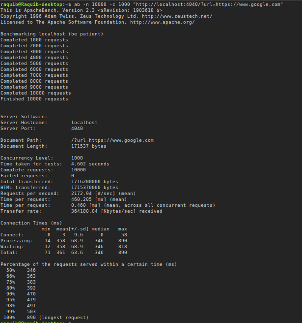

# 🌐 ProxyRaQ

A **multithreaded proxy web server** built entirely in **pure C**, designed for performance, modularity, and scalability.
Supports **HTTP/HTTPS requests**, **caching with LRU strategy**, **site blocking**, and **high concurrency handling**.

---

## ✨ Features

* **Multithreaded Proxy Server** – Handles multiple client connections concurrently using a **thread pool**.
* **Custom Fetch Utility (C-based)** – Fetches remote websites without external libraries, mimicking `fetch` behavior.
* **HTTP Parser** – Minimal and custom-built parser tailored to proxy needs.
* **LRU-based Cache Strategy**

  * **In-Memory (Linked List)** for quick lookups.
  * **Disk-based Storage + Persistence** for large resources.
  * **Cache Invalidation** logic for expired/blocked entries.
* **Site Blocking** – Reads `blocked_sites.json` to deny access to restricted domains.
* **SSL/TLS Support** – Wraps TCP sockets with SSL for HTTPS connections.
* **Dynamic Memory Allocation** – Efficient fetching of large websites.
* **Modular Code Structure** – Each component (parsing, caching, networking, SSL, thread pool) is an independent module.
* 🐳 **Dockerized** for easy setup, deployment, and portability.

---

## 🏗️ Architecture

```
                ┌───────────────────┐
Client Request →│ ProxyRaQ Listener │─┐
                └───────────────────┘ │
                         │             │
                         ▼             │
                 ┌───────────────┐     │
                 │ Thread Pool    │     │
                 └───────────────┘     │
                         │             │
   ┌───────────────┐  ┌──────────────┐ │
   │ HTTP Parser    │  │ Site Blocker │ │
   └───────────────┘  └──────────────┘ │
                         │             │
                         ▼             │
            ┌───────────────────────────────┐
            │ Cache (LRU + Disk Persistence) │
            └───────────────────────────────┘
                         │
                         ▼
               ┌──────────────────┐
               │ Remote Web Server │
               └──────────────────┘
```
* **Client → ProxyRaQ → Remote Server → ProxyRaQ → Client**
* Handles requests concurrently using a **thread pool**.
* Stores responses in **LRU cache** (RAM + disk) for faster future lookups.
* Filters requests if they match entries in the **blocked sites list**.
* Supports both **HTTP & HTTPS** traffic.

---

## 📊 Benchmarks

The proxy was tested locally using **ApacheBench (ab)** on a **4-core CPU**.
We measured throughput and latency with different concurrency levels.

| Clients (Concurrency) | Requests | Requests/sec | Mean Latency | Longest Request | Failures |
| --------------------- | -------- | ------------ | ------------ | --------------- | -------- |
| **100**               | 10,000   | \~2261 req/s | \~44 ms      | 876 ms          | 0        |
| **1000**              | 10,000   | \~2172 req/s | \~460 ms     | 890 ms          | 0        |

✅ Even under **1000 concurrent clients**, ProxyRaQ handled all **10k requests without failure**.
⚙️ Increasing backlog size from **10 → 1024** was essential to support high concurrency.

---

### 📸 Benchmark Screenshot


*(1000 concurrent clients, 10k requests, no failures)*

---

## 🔍 Observations

* Raising the **socket backlog** (`listen(fd, backlog)`) from `10` → `1024` improved stability under load.
* The proxy maintains **consistent throughput (\~2k req/s)** even at **10× concurrency**.
* Latency scales linearly with concurrency, as expected due to queuing + thread pool scheduling.
* No failed requests in either scenario, demonstrating robust handling.

---

## 🐳 Docker Support

ProxyRaQ is fully **Dockerized** for easy deployment.

### Build Image

```bash
docker build -t proxyraq .
```

### Run Container

```bash
docker run -p 4040:4040 proxyraq
```

Now the proxy server will be running at:
👉 `http://localhost:4040/?url=https://example.com`

---

## 🚀 Getting Started

### 1. Clone Repository

```bash
git clone https://github.com/yourusername/proxyraq.git
cd proxyraq
```

### 2. Build

```bash
make
```

### 3. Run

```bash
PORT=4040 ./server
```

### 4. Test with ApacheBench

```bash
ab -n 10000 -c 100 "http://localhost:4040/?url=https://wikipedia.org"
```

---

## 📂 Project Structure

```
proxyraq/
├── src/
│   ├── main.c
│   ├── http_parser.c
│   ├── cache.c
│   ├── thread_pool.c
│   ├── ssl_wrapper.c
│   └── site_blocker.c
├── include/
│   ├── http_parser.h
│   ├── cache.h
│   ├── thread_pool.h
│   ├── ssl_wrapper.h
│   └── site_blocker.h
├── blocked_sites.json
├── Makefile
├── Dockerfile
└── README.md
```

---

## 📌 Future Improvements

* 📊 Add monitoring & metrics dashboard.
* 🧵 Support for asynchronous I/O (epoll-based).
* 📂 Smarter cache eviction strategies.
* 🔐 Better TLS certificate management.

---

## 👨‍💻 Author

Built with ❤️ in **C** by **Raquib**
---